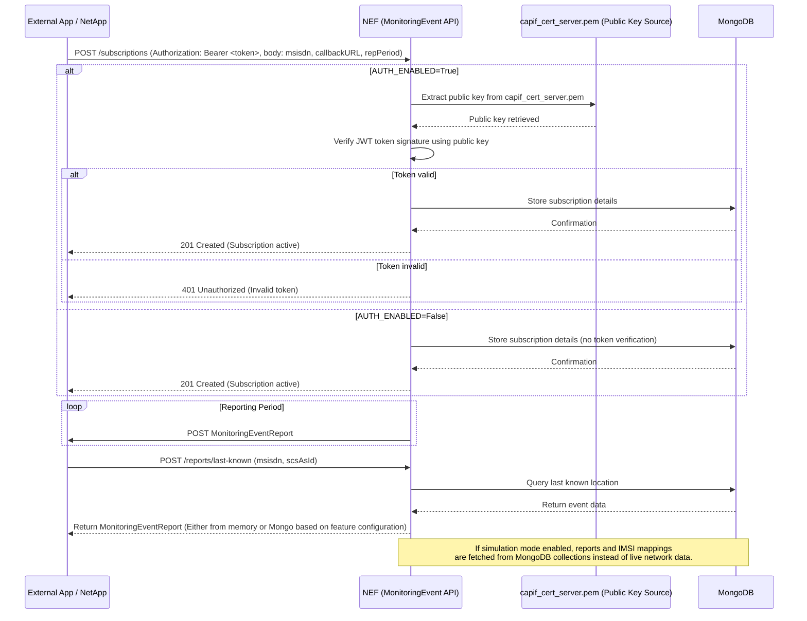

# NEF MonitoringEvent API (3GPP TS 29.122)

This repository provides a **Network Exposure Function (NEF)** implementation for the **MonitoringEvent API** as specified in **3GPP TS 29.122**.  
It is built using **Python** and **FastAPI**, containerized via **Docker**, and supports both **CAPIF-enabled** and **non-secure** deployments.

---

## 🧩 Overview

The NEF MonitoringEvent API allows external applications to:
- **Subscribe** to monitoring events such as user **current location**.
- **Receive reports** (via callback URL) based on event occurrences or configured intervals.
- **Query the last known location** for specific subscribers.
- **Simulate MonitoringEventReports** via MongoDB for testing or integration with northbound APIs like **CAMARA** or **xAPP**.

The implementation follows the **3GPP TS 29.122** specification for MonitoringEvent API and supports integration within the **CAPIF** security framework.

---

## ⚙️ Features

### 1. CAPIF-ready Security
- Controlled via the `.env` file using:  
  ```bash
  AUTH_ENABLED=True
  ```
- When enabled:
  - Deploys NEF MonitoringEvent API as CAPIF-enabled provider app with regards to **CAPIF framework** for secure communication and validation.
  - Provides token verification via **certificate (`capif_cert_server.pem`)** obtained from an external SFTP server.
  - Enables **Swagger UI authorization** for API testing.
### 2. Monitoring Event: Current Location
- Allows users to subscribe for location monitoring of a target MSISDN.
- Parameters that are supported, include:
  - `notificationDestination`: AF's callback URL for receiving MonitoringEvent reports.
  - `maxNumberOfReports`: Maximum number of reports NEF will send.
  - `repPeriod`: Reporting interval in seconds.
- NEF sends MonitoringEventReports based on network-detected location updates.
### 3. Monitoring Event: Last Known Location
- Provides immediate MonitoringEventReport for a given `scsAsId` and `msisdn`.
- Returns the last known location from memory if any record exists.
### 4. Monitoring Event: Last Known Location as MongoDB-based Simulation (CAMARA / xAPP Integration) 
- Simulated **MonitoringEventReports** are preconfigured in MongoDB.
- IMSI mapper collection links **phone numbers ↔ IMSI identifiers**.
- Enables northbound consumers (like **CAMARA Device Location API**) to fetch monitoring events without live network dependency.

---

## 🏗️ Architecture & Deployment


### Prerequisites
- [Docker](https://www.docker.com/)
- [Docker Compose](https://docs.docker.com/compose/)
- [Make](https://www.gnu.org/software/make/)
- Python 3.12

### Clone the repository
```bash
git clone https://github.com/FRONT-research-group/NEF.git
cd NEF
```

The deployment process is **Makefile-driven** using `docker-compose` files.

### Environment Configuration
All configuration is managed through a `.env` file (see more in the `.env` for **feature related configuration**).

## Deployment Commands
| Command                         | Description                                                                    |
| ------------------------------- | ------------------------------------------------------------------------------ |
| `make deploy`                   | Deploys the NEF application, execute sftp script and configure networks        |
| `make clean`                    | Stops containers, removes volumes, and cleans up networks                      |

To deploy CAPIF-ready deployment, environment variable `AUTH_ENABLED` must be set to `True`.  
After that, the `make deploy` target will deploy 2 `docker-compose` files, one **base** file and one **overlay auth** file, `docker-compose.yaml` and `docker-compose.auth.yaml`, respectively. 

## Initialization & Simulation for Last Known Location as MongoDB-based Simulation
The `init_db_setup` folder includes `python scripts` to prepopulate MongoDB with:

- `MonitoringEventReports` for last known location entries.
- IMSI mapper entries for test phoneNumbers.
This setup allows the NEF to simulate MonitoringEventReports for northbound APIs.
Create a python `venv` and install `requirements.txt` to execute the `python scripts`.

## 📡 API Summary
### Base Endpoints
| Method  | Endpoint                                                                   | Description                                                      |
| ------- | ---------------------------------------------------------------------------| ---------------------------------------------------------------- |
| `POST`  | `/3gpp-monitoring-event/v1/{scsAsId}/subscriptions`                        | Create a MonitoringEvent subscription (current location)         |
| `GET`   | `/3gpp-monitoring-event/v1/{scsAsId}/subscriptions/`                       | Read all of the active subscriptions for the AF                  |
| `GET`   | `/3gpp-monitoring-event/v1/{scsAsId}/subscriptions/{subscriptionId}`       | Read an active subscription for the AF and the subscription Id   |
| `DELETE`| `/3gpp-monitoring-event/v1/{scsAsId}/subscriptions/{subscriptionId}`       | Deletes an already existing subscription                         |

### Example Subscription POST Request
```
{
  "accuracy": "CGI_ECGI",
  "msisdn": "001010143245445",
  "notificationDestination": "http://test_server:8001",
  "monitoringType": "LOCATION_REPORTING",
  "maximumNumberOfReports": 3,
  "locationType": "CURRENT_LOCATION",
  "repPeriod": {
    "duration": 20
  }
}
```

---

## 🧩 Sequence Flow Diagram


---

## Contribution
Contributions are welcome! Please open issues or submit pull requests for improvements.

## License
This project is licensed under the [Apache License 2.0](https://github.com/FRONT-research-group/NEF/blob/main/LICENSE).

## Contact
For questions or support, contact: p.pavlidis@iit.demokritos.gr


